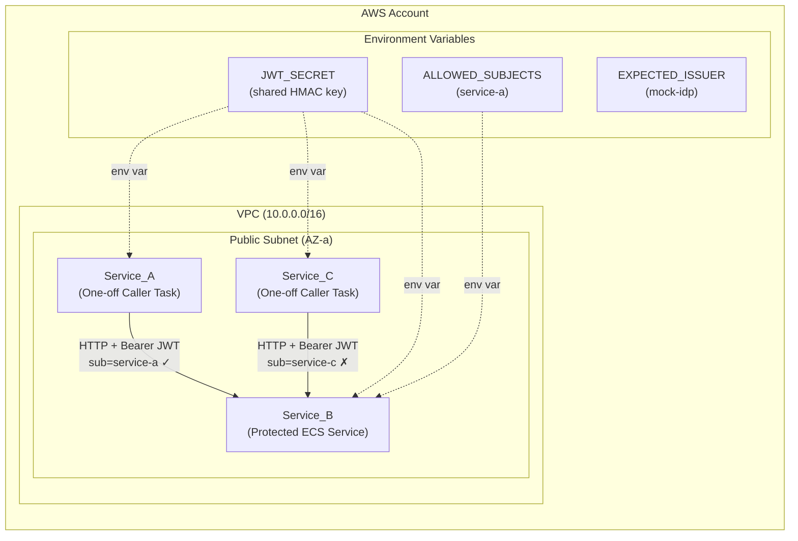
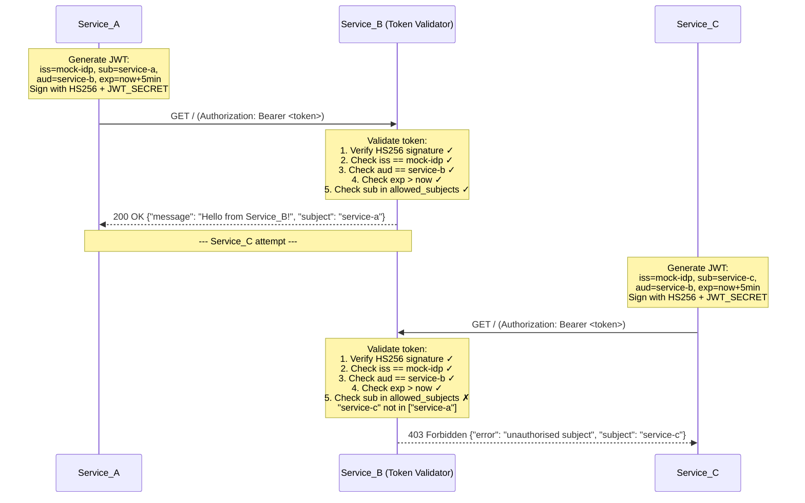
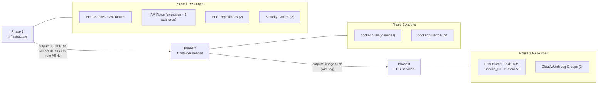
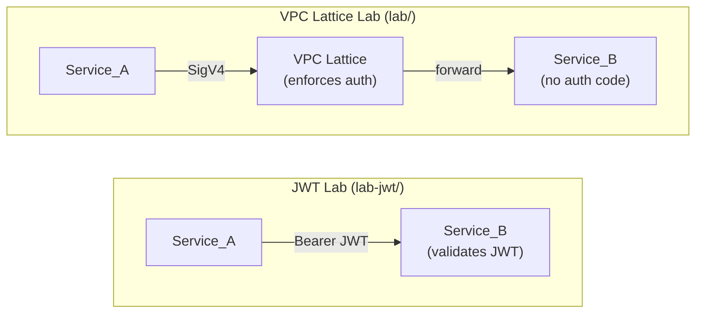

# Design Document: JWT Service-to-Service Auth Lab

## Overview

This design describes a hands-on tutorial that teaches application-layer service-to-service authentication using JWT (JSON Web Tokens). The lab deploys a minimal AWS environment and demonstrates both successful and blocked inter-service communication — identical observable outcomes to the existing VPC Lattice lab, but with auth enforced by the application rather than infrastructure.

The core teaching objective is the **authentication vs authorization distinction**: Service_C presents a valid, correctly-signed token (proving identity) but is rejected because its subject (`service-c`) is not in Service_B's allowed subjects list (lacking authorization).

### Design Goals

- **Minimal cost**: Single AZ, smallest Fargate sizes, no NAT Gateway, no VPC Lattice charges
- **Self-contained**: No pre-existing resources required; clean account/region
- **Readable**: All Terraform inline, all containers under 50 lines, inline comments
- **Observable**: Clear positive/negative test outcomes visible in ECS logs
- **Phased deployment**: Infrastructure → Images → Services
- **Parallel**: Lives at `lab-jwt/` alongside existing `lab/` without modification

### Key Design Decision: Shared HMAC Signing Key

⚠️ **Lab simplification**: All services share the same HMAC signing key via environment variable. This allows callers to mint their own tokens — a pattern that would be unacceptable in production. The tutorial explicitly documents this trade-off and explains that production systems use asymmetric keys with a trusted identity provider.

---

## Architecture

### High-Level Design



### Auth Flow — Sequence Diagram



### Deployment Phase Diagram



### Comparison with VPC Lattice Lab



---

## Components and Interfaces

### 1. Network Layer

| Resource | Configuration | Purpose |
|----------|--------------|---------|
| VPC | CIDR `10.0.0.0/16` | Isolated network for all lab resources |
| Public Subnet | `10.0.1.0/24`, single AZ (e.g. `us-east-1a`) | Hosts all ECS tasks |
| Internet Gateway | Attached to VPC | Enables outbound internet for image pulls |
| Route Table | `0.0.0.0/0` → IGW | Routes internet traffic |
| Security Group (callers) | Egress: all; Ingress: none | Allows outbound only |
| Security Group (Service_B) | Egress: all; Ingress: TCP 5000 from callers SG | Allows caller tasks to reach Service_B |

**Design Decision**: No NAT Gateway — same as VPC Lattice lab. Public IPs on Fargate tasks provide outbound connectivity at zero additional cost. Service_B's security group allows inbound on port 5000 from the callers security group (not from VPC Lattice prefix list, since there is no Lattice).

### 2. IAM Layer

| Resource | Configuration | Purpose |
|----------|--------------|---------|
| Task Execution Role | Shared; allows ECR pull + CloudWatch Logs | ECS agent operations |
| Task Role A | No special permissions | Service_A identity (structural parity with VPC Lattice lab) |
| Task Role B | No special permissions | Service_B identity |
| Task Role C | No special permissions | Service_C identity |

**Design Decision**: Task roles have no Lattice permissions (removed per Requirement 2). They exist solely for structural parity with the VPC Lattice lab and to give each service a unique IAM identity. In the JWT lab, authorization is enforced by the application, not by IAM.

### 3. Container Registry

| Resource | Configuration | Purpose |
|----------|--------------|---------|
| ECR Repo: `jwt-lab/caller` | Mutable tags, no lifecycle policy | Stores caller image (used by both Service_A and Service_C) |
| ECR Repo: `jwt-lab/service-b` | Mutable tags, no lifecycle policy | Stores Service_B image |

### 4. ECS Compute Layer

| Resource | Configuration | Purpose |
|----------|--------------|---------|
| ECS Cluster | Fargate-only | Hosts all services/tasks |
| Task Definition A | 0.25 vCPU, 0.5 GB, `awsvpc`, Task Role A | Runs Service_A caller script |
| Task Definition B | 0.25 vCPU, 0.5 GB, `awsvpc`, Task Role B | Runs Service_B container |
| Task Definition C | 0.25 vCPU, 0.5 GB, `awsvpc`, Task Role C | Runs Service_C caller script |
| ECS Service B | desired_count=1, public IP | Long-running service |
| ECS Task A (one-off) | Launched via `aws ecs run-task` | Executes caller, exits |
| ECS Task C (one-off) | Launched via `aws ecs run-task` | Executes caller, exits |

**Design Decision**: Service_B runs as a persistent ECS Service so it's available when callers execute. Service_A and Service_C are one-off tasks — same pattern as the VPC Lattice lab.

### 5. Application Layer

#### Service_B (Protected Target — Flask + JWT validation)

```
Framework: Python Flask + PyJWT
Port: 5000
Endpoint: GET /
Auth: Validates Bearer JWT from Authorization header
Validation steps:
  1. Extract token from Authorization header
  2. Verify HS256 signature using JWT_SECRET
  3. Verify iss == EXPECTED_ISSUER
  4. Verify aud == "service-b"
  5. Verify exp > current time
  6. Verify sub is in ALLOWED_SUBJECTS list
Success response: 200 {"message": "Hello from Service_B!", "subject": "<sub>", "timestamp": "<ISO8601>"}
Failure responses:
  - 401 {"error": "missing authorization header"}
  - 401 {"error": "invalid signature"}
  - 401 {"error": "token expired"}
  - 401 {"error": "invalid issuer"}
  - 403 {"error": "invalid audience"}
  - 403 {"error": "unauthorised subject", "subject": "<sub>"}
Lines: <50
Dependencies: flask, pyjwt
```

#### Service_A (Authorised Caller — one-off task)

```
Framework: Python script (requests + pyjwt)
Behaviour:
  1. Read JWT_SECRET and SERVICE_B_URL from environment
  2. Generate JWT: iss=mock-idp, sub=service-a, aud=service-b, exp=now+5min
  3. Sign with HS256
  4. Send GET to SERVICE_B_URL with Authorization: Bearer <token>
  5. Print response status and body
  6. On timeout/connection error: print "NETWORK ERROR" (distinct from auth error)
Timeout: 5 seconds
Lines: <50
Dependencies: requests, pyjwt
```

#### Service_C (Unauthorised Caller — one-off task)

```
Framework: Python script (requests + pyjwt) — same image as Service_A
Behaviour: Identical to Service_A except sub=service-c
Expected outcome: HTTP 403 (unauthorised subject)
Lines: <50
Dependencies: requests, pyjwt
```

**Design Decision**: Service_A and Service_C use the same Docker image with different `CALLER_SUBJECT` environment variable. This mirrors the VPC Lattice lab pattern where both use the same caller image but different IAM roles. The difference is now in the JWT subject claim rather than IAM permissions.

---

## Data Models

### JWT Token Structure

```json
{
  "header": {
    "alg": "HS256",
    "typ": "JWT"
  },
  "payload": {
    "iss": "mock-idp",
    "sub": "service-a",
    "aud": "service-b",
    "exp": 1700000000
  }
}
```

| Claim | Type | Value (Service_A) | Value (Service_C) | Purpose |
|-------|------|-------------------|-------------------|---------|
| `iss` | string | `mock-idp` | `mock-idp` | Identifies token issuer |
| `sub` | string | `service-a` | `service-c` | Identifies calling service |
| `aud` | string | `service-b` | `service-b` | Identifies target service |
| `exp` | int (unix timestamp) | now + 300s | now + 300s | Token expiry |

### Environment Variables

| Variable | Service | Source | Purpose |
|----------|---------|--------|---------|
| `JWT_SECRET` | A, B, C | Task definition (hardcoded in Terraform) | Shared HMAC signing key |
| `CALLER_SUBJECT` | A, C | Task definition (`service-a` or `service-c`) | Subject claim for JWT generation |
| `SERVICE_B_URL` | A, C | Passed via `run-task` overrides | Target URL (e.g. `http://<task-ip>:5000`) |
| `ALLOWED_SUBJECTS` | B | Task definition (e.g. `service-a`) | Comma-separated list of allowed subjects |
| `EXPECTED_ISSUER` | B | Task definition (e.g. `mock-idp`) | Expected value of `iss` claim |

### Project Structure

```
lab-jwt/
├── phase1/
│   ├── main.tf          # Provider, VPC, subnet, IGW, routes
│   ├── iam.tf           # Task roles, execution role (no Lattice permissions)
│   ├── ecr.tf           # ECR repositories (2: caller, service-b)
│   ├── security.tf      # Security groups (callers, service-b)
│   ├── outputs.tf       # Exported values for Phase 3
│   └── variables.tf     # Region, naming prefix
├── phase3/
│   ├── main.tf          # Provider, data sources
│   ├── ecs.tf           # Cluster, task definitions, Service_B ECS service, log groups
│   ├── outputs.tf       # Service_B task IP retrieval instructions
│   └── variables.tf     # Image URIs, Phase 1 outputs, JWT_SECRET
├── services/
│   ├── caller/
│   │   ├── caller.py    # Python script: generate JWT, send request, log result
│   │   ├── Dockerfile
│   │   └── requirements.txt  # requests, pyjwt
│   └── service_b/
│       ├── app.py       # Flask app with JWT validation
│       ├── Dockerfile
│       └── requirements.txt  # flask, pyjwt
└── README.md            # Tutorial document with comparison section
```

### Service_B Validation Logic (Pseudocode)

```python
def validate_request(request):
    # 1. Extract token
    auth_header = request.headers.get("Authorization")
    if not auth_header or not auth_header.startswith("Bearer "):
        return 401, {"error": "missing authorization header"}

    token = auth_header.split(" ", 1)[1]

    # 2. Decode and verify (signature + expiry + algorithm)
    try:
        payload = jwt.decode(token, JWT_SECRET, algorithms=["HS256"],
                            audience="service-b", issuer=EXPECTED_ISSUER)
    except jwt.InvalidSignatureError:
        return 401, {"error": "invalid signature"}
    except jwt.ExpiredSignatureError:
        return 401, {"error": "token expired"}
    except jwt.InvalidIssuerError:
        return 401, {"error": "invalid issuer"}
    except jwt.InvalidAudienceError:
        return 403, {"error": "invalid audience"}

    # 3. Check subject authorization
    subject = payload.get("sub", "")
    if subject not in ALLOWED_SUBJECTS:
        return 403, {"error": "unauthorised subject", "subject": subject}

    # 4. Success
    return 200, {"message": "Hello from Service_B!", "subject": subject, "timestamp": now()}
```

---


## Correctness Properties

*A property is a characteristic or behavior that should hold true across all valid executions of a system — essentially, a formal statement about what the system should do. Properties serve as the bridge between human-readable specifications and machine-verifiable correctness guarantees.*

### Property 1: Token generation round-trip

*For any* valid subject string and audience string, generating a JWT with those values and then decoding it with the same secret should yield a payload containing the original `sub`, `aud`, `iss`, and a valid future `exp` timestamp.

**Validates: Requirements 3.1, 3.3, 3.4, 3.5**

### Property 2: Invalid signature rejection

*For any* JWT signed with a key different from Service_B's configured `JWT_SECRET`, Service_B's token validator should return HTTP 401 with an "invalid signature" error.

**Validates: Requirements 5.3**

### Property 3: Expired token rejection

*For any* JWT where the `exp` claim is a timestamp in the past, Service_B's token validator should return HTTP 401 with a "token expired" error, regardless of all other claims being valid.

**Validates: Requirements 5.4**

### Property 4: Invalid issuer rejection

*For any* JWT where the `iss` claim does not equal Service_B's configured `EXPECTED_ISSUER`, Service_B's token validator should return HTTP 401 with an "invalid issuer" error.

**Validates: Requirements 5.11**

### Property 5: Wrong audience rejection

*For any* JWT where the `aud` claim does not equal `service-b`, Service_B's token validator should return HTTP 403 with an "invalid audience" error.

**Validates: Requirements 5.5**

### Property 6: Unauthorised subject rejection

*For any* JWT with a valid signature, non-expired, correct issuer, correct audience, but where the `sub` claim is not in Service_B's configured `ALLOWED_SUBJECTS` list, Service_B's token validator should return HTTP 403 with an "unauthorised subject" error.

**Validates: Requirements 5.6**

### Property 7: Valid token acceptance

*For any* JWT with a valid HS256 signature, non-expired `exp`, `iss` matching `EXPECTED_ISSUER`, `aud` equal to `service-b`, and `sub` present in `ALLOWED_SUBJECTS`, Service_B's token validator should return HTTP 200 with a JSON body containing the subject.

**Validates: Requirements 5.7**

### Property 8: Algorithm restriction

*For any* JWT signed with an algorithm other than HS256 (e.g. HS384, HS512, RS256, none), Service_B's token validator should reject the token with HTTP 401, even if the signature would otherwise be valid.

**Validates: Requirements 5.13**

### Property 9: Network error distinction

*For any* connection timeout or connection refused error encountered by a caller, the log output should contain a network error indicator (e.g. "NETWORK ERROR"). For any HTTP 401 or 403 response, the log output should NOT contain a network error indicator.

**Validates: Requirements 4.7, 6.7**

---

## Error Handling

### Token Validation Errors (Service_B)

| Error Condition | HTTP Status | Response Body | Log Message |
|----------------|-------------|---------------|-------------|
| No Authorization header | 401 | `{"error": "missing authorization header"}` | `DENIED: no auth header` |
| Malformed Bearer token | 401 | `{"error": "missing authorization header"}` | `DENIED: malformed auth header` |
| Invalid HS256 signature | 401 | `{"error": "invalid signature"}` | `DENIED: invalid signature` |
| Token expired | 401 | `{"error": "token expired"}` | `DENIED: token expired` |
| Invalid issuer | 401 | `{"error": "invalid issuer"}` | `DENIED: invalid issuer, got=<iss>` |
| Wrong audience | 403 | `{"error": "invalid audience"}` | `DENIED: invalid audience, got=<aud>` |
| Unauthorised subject | 403 | `{"error": "unauthorised subject", "subject": "<sub>"}` | `DENIED: unauthorised subject=<sub>` |
| Valid token | 200 | `{"message": "Hello from Service_B!", "subject": "<sub>", "timestamp": "..."}` | `ACCEPTED: subject=<sub>` |

**Design Decision — 401 vs 403**: Authentication failures (can't verify who you are) return 401. Authorization failures (verified identity but not permitted) return 403. This maps to the teaching objective: Service_C is authenticated (valid token) but not authorized (wrong subject).

### Caller Errors (Service_A / Service_C)

| Error Condition | Output | Exit Code |
|----------------|--------|-----------|
| HTTP 200 | `AUTH SUCCESS: status=200 body=<response>` | 0 |
| HTTP 401 | `AUTH DENIED: status=401 body=<response>` | 0 |
| HTTP 403 | `AUTH DENIED: status=403 body=<response>` | 0 |
| Connection timeout (5s) | `NETWORK ERROR: Connection timed out` | 1 |
| Connection refused | `NETWORK ERROR: Connection refused` | 1 |
| DNS resolution failure | `NETWORK ERROR: <details>` | 1 |
| Missing SERVICE_B_URL env var | `ERROR: SERVICE_B_URL not set` | 1 |
| Missing JWT_SECRET env var | `ERROR: JWT_SECRET not set` | 1 |

**Design Decision**: Network errors exit with code 1 and use "NETWORK ERROR" prefix. Auth responses (even denials) exit with code 0 since the HTTP round-trip succeeded. This makes it trivial to distinguish connectivity issues from auth issues in logs.

### Deployment Failures

| Failure Mode | Cause | Resolution |
|-------------|-------|------------|
| ECR push auth failure | Docker not logged in to ECR | Run `aws ecr get-login-password \| docker login` |
| ECS task fails to start | Image not found in ECR | Verify image URI matches ECR repo + tag |
| ECS task stuck in PROVISIONING | Subnet has no route to internet | Verify IGW attached and route table associated |
| Service_B unreachable | Security group doesn't allow inbound 5000 | Check SG rules allow callers SG → port 5000 |
| Caller gets NETWORK ERROR | SERVICE_B_URL incorrect or Service_B not running | Verify Service_B task is RUNNING and IP is correct |

---

## Testing Strategy

### Validation Approach

The lab uses a **dual testing strategy**:
1. **Property-based tests** for Service_B's JWT validation logic (run locally, no AWS needed)
2. **Manual integration tests** for end-to-end ECS deployment verification

### Property-Based Tests (Local)

**Library**: `hypothesis` (Python property-based testing framework)
**Target**: Service_B's token validation logic extracted as a testable function
**Minimum iterations**: 100 per property

Each property test references its design document property:

```python
# Feature: jwt-service-auth-lab, Property 1: Token generation round-trip
# Feature: jwt-service-auth-lab, Property 2: Invalid signature rejection
# Feature: jwt-service-auth-lab, Property 3: Expired token rejection
# ...
```

**Test file location**: `lab-jwt/tests/test_jwt_validation.py`

**Generators needed**:
- Random strings for subject, audience, issuer claims
- Random timestamps (past and future) for expiry
- Random byte strings for signing keys
- Random algorithm names from a set of known JWT algorithms

### Unit Tests (Local)

- Service_A generates correct token structure (specific example)
- Service_C generates correct token structure (specific example)
- Caller output formatting for success/denial/network error cases
- Missing environment variable handling

### Integration Tests (AWS — Manual)

#### Test 1: Positive Auth (Service_A → Service_B)

```bash
# Run Service_A as a one-off task
aws ecs run-task --cluster jwt-lab-cluster \
  --task-definition service-a \
  --network-configuration "awsvpcConfiguration={subnets=[<subnet-id>],securityGroups=[<sg-callers-id>],assignPublicIp=ENABLED}" \
  --overrides '{
    "containerOverrides": [
      {
        "name": "caller",
        "environment": [
          {"name": "SERVICE_B_URL", "value": "http://<service-b-ip>:5000"}
        ]
      }
    ]
  }'

# View logs
aws logs tail /ecs/jwt-service-a --since 5m
```

**Expected output:**
```
AUTH SUCCESS: status=200 body={"message": "Hello from Service_B!", "subject": "service-a", "timestamp": "2024-..."}
```

#### Test 2: Negative Auth (Service_C → Service_B)

```bash
# Run Service_C as a one-off task
aws ecs run-task --cluster jwt-lab-cluster \
  --task-definition service-c \
  --network-configuration "awsvpcConfiguration={subnets=[<subnet-id>],securityGroups=[<sg-callers-id>],assignPublicIp=ENABLED}" \
  --overrides '{
    "containerOverrides": [
      {
        "name": "caller",
        "environment": [
          {"name": "SERVICE_B_URL", "value": "http://<service-b-ip>:5000"}
        ]
      }
    ]
  }'

# View logs
aws logs tail /ecs/jwt-service-c --since 5m
```

**Expected output:**
```
AUTH DENIED: status=403 body={"error": "unauthorised subject", "subject": "service-c"}
```

### Smoke Tests (Post-Deployment)

| Check | Command | Expected |
|-------|---------|----------|
| Service_B task running | `aws ecs list-tasks --cluster jwt-lab-cluster --service-name service-b` | 1 task ARN |
| Service_B reachable | Check task IP from `describe-tasks` output | IP assigned |
| Service_A log shows 200 | `aws logs tail /ecs/jwt-service-a --since 5m` | Contains "AUTH SUCCESS" |
| Service_C log shows 403 | `aws logs tail /ecs/jwt-service-c --since 5m` | Contains "AUTH DENIED" |

### Terraform Validation

- `terraform validate` — syntax and reference checks
- `terraform plan` — preview resource creation before apply
- Post-apply verification commands for each resource type (provided in tutorial)
