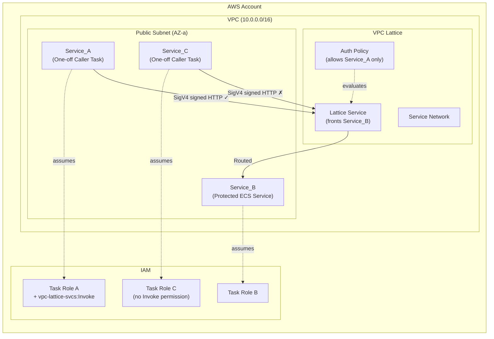
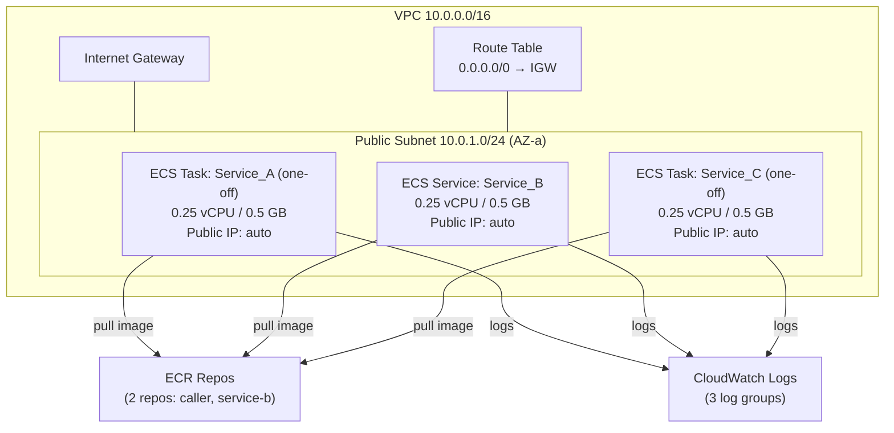
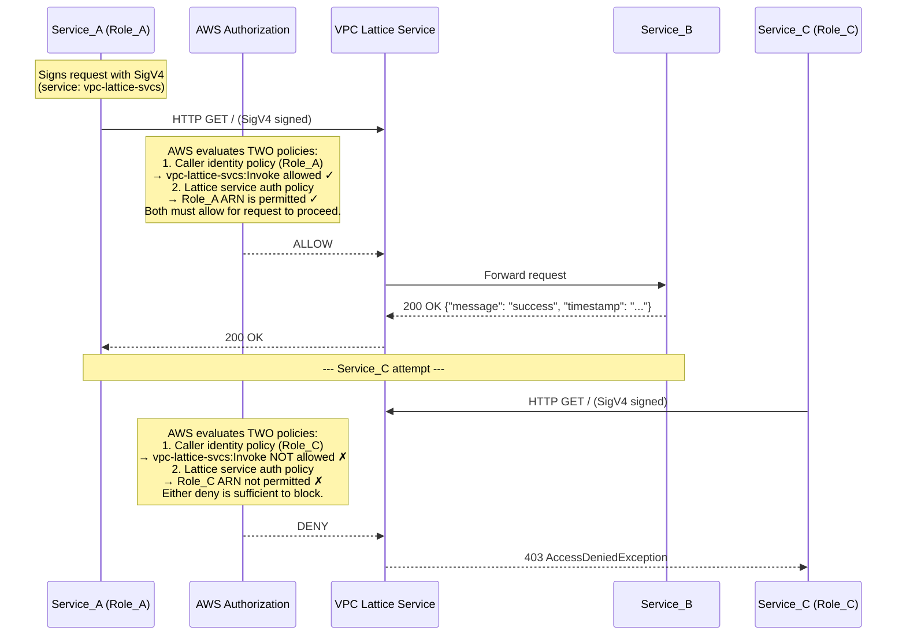
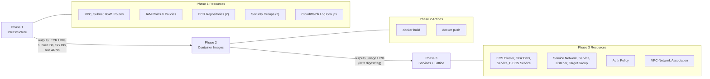

# Design Document: VPC Lattice Service-to-Service Auth Lab

## Overview

This design describes a hands-on tutorial that teaches VPC Lattice service-to-service authentication using IAM authorization. The lab deploys a minimal AWS environment from scratch and demonstrates both successful and blocked inter-service communication.

The core teaching objective is the **dual authorization model**: a request succeeds only when BOTH the caller's identity-based IAM policy allows `vpc-lattice-svcs:Invoke` AND the VPC Lattice auth policy permits the caller's principal.

### Design Goals

- **Minimal cost**: Single AZ, smallest Fargate sizes, no NAT Gateway
- **Self-contained**: No pre-existing resources required; clean account/region
- **Readable**: All Terraform inline, all containers under 50 lines, inline comments
- **Observable**: Clear positive/negative test outcomes visible in ECS logs
- **Phased deployment**: Infrastructure → Images → Services+Lattice

---

## Architecture

### High-Level Design



### Low-Level Design — Network & Compute



### Low-Level Design — VPC Lattice & Auth Flow



**Authorization Model Clarification**: The VPC Lattice auth policy does not itself check the caller's identity-based IAM policy. AWS authorization evaluates both policies independently: (a) the caller's identity-based IAM policy must allow `vpc-lattice-svcs:Invoke`, and (b) the VPC Lattice service auth policy must permit the caller's principal. The request is forwarded only if both allow.

### Deployment Phase Diagram



---

## Components and Interfaces

### 1. Network Layer

| Resource | Configuration | Purpose |
|----------|--------------|---------|
| VPC | CIDR `10.0.0.0/16` | Isolated network for all lab resources |
| Public Subnet | `10.0.1.0/24`, single AZ (e.g. `us-east-1a`) | Hosts all ECS tasks |
| Internet Gateway | Attached to VPC | Enables outbound internet for image pulls |
| Route Table | `0.0.0.0/0` → IGW | Routes internet traffic |
| Security Group (callers) | Egress: all; Ingress: none | Allows outbound only; no inbound from public internet |
| Security Group (Service_B) | Egress: all; Ingress: TCP 5000 from the AWS-managed VPC Lattice prefix list for the region | Allows Lattice to reach Service_B; no inbound from public internet |

**Design Decision**: No NAT Gateway. Public IPs on Fargate tasks provide outbound connectivity at zero additional cost. This is acceptable for a learning environment and explicitly documented as not production-appropriate. Service_B's security group uses the AWS-managed VPC Lattice prefix list for the region to allow inbound on port 5000 — this is the only inbound rule in the lab. The exact prefix list ID is looked up at deploy time via Terraform data source. No security group permits inbound traffic from `0.0.0.0/0`.

### 2. IAM Layer

| Resource | Configuration | Purpose |
|----------|--------------|---------|
| Task Execution Role | Shared; allows ECR pull + CloudWatch Logs | ECS agent operations |
| Task Role A (`service-a-task-role`) | Identity policy: allow `vpc-lattice-svcs:Invoke` on `*` (see note below) | Service_A's identity for Lattice calls |
| Task Role B (`service-b-task-role`) | No Lattice permissions | Service_B doesn't call Lattice |
| Task Role C (`service-c-task-role`) | No Lattice permissions (baseline) | Service_C cannot invoke Lattice |

**Design Decision**: A single shared execution role simplifies the lab without compromising the teaching objective. Task roles are unique per service to demonstrate identity-based authorization.

**IAM Policy Scoping Note**: The lab uses `Resource: "*"` for `vpc-lattice-svcs:Invoke` for simplicity because the Lattice service ARN is not known until Phase 3 apply completes. **⚠️ In production, this MUST be scoped to the specific VPC Lattice service ARN** (e.g. `arn:aws:vpc-lattice:<region>:<account>:service/<service-id>`).

### 3. Container Registry

| Resource | Configuration | Purpose |
|----------|--------------|---------|
| ECR Repo: `lab/caller` | Mutable tags, no lifecycle policy | Stores caller image (used by both Service_A and Service_C tasks) |
| ECR Repo: `lab/service-b` | Mutable tags, no lifecycle policy | Stores Service_B image |

### 4. ECS Compute Layer

| Resource | Configuration | Purpose |
|----------|--------------|---------|
| ECS Cluster | Fargate-only, no capacity providers | Hosts all services/tasks |
| Task Definition A | 0.25 vCPU, 0.5 GB, `awsvpc`, Task Role A | Runs Service_A caller script |
| Task Definition B | 0.25 vCPU, 0.5 GB, `awsvpc`, Task Role B | Runs Service_B container |
| Task Definition C | 0.25 vCPU, 0.5 GB, `awsvpc`, Task Role C | Runs Service_C caller script |
| ECS Service B | desired_count=1, public IP, LATEST platform | Long-running service maintaining Service_B task |
| ECS Task A (one-off) | Launched via `aws ecs run-task` during testing | Executes caller script, exits on completion |
| ECS Task C (one-off) | Launched via `aws ecs run-task` during testing | Executes caller script, exits on completion |

**Design Decision**: Service_B is a long-running ECS Service because it must be available to receive requests and pass Lattice target group health checks. Service_A and Service_C are one-off ECS tasks (`run-task`) triggered during the testing phase — they execute a single request, log the result, and exit. This avoids unnecessary running costs and better reflects the test-caller nature of these services.

### 5. VPC Lattice Layer

| Resource | Configuration | Purpose |
|----------|--------------|---------|
| Service Network | Default settings | Groups services together |
| VPC Association | VPC ↔ Service Network | Enables VPC tasks to reach Lattice services |
| Lattice Service | Auth type: `AWS_IAM` | Fronts Service_B with IAM auth |
| Listener | Protocol: HTTP, Port: 80, default forward action | Routes all requests to target group |
| Target Group | Type: IP, Protocol: HTTP, Port: 5000, health check on `/` | Points to Service_B tasks (auto-registered by ECS service) |
| Auth Policy | JSON policy allowing only Role_A's ARN | Enforces service-level authorization |

**Design Decision**: HTTP (not HTTPS) listener simplifies the lab by avoiding certificate management. The auth policy uses an explicit allow for Service_A's role ARN with an implicit deny for all others.

**Target Group Registration**: The Service_B ECS service is associated with the VPC Lattice target group. ECS automatically registers and deregisters Service_B task IPs as targets when tasks start or stop — no manual target management is required.

### 6. Application Layer

#### Service_B (Protected Target — long-running ECS Service)

```
Framework: Python Flask
Port: 5000
Endpoint: GET /
Response: {"message": "Hello from Service_B!", "timestamp": "<ISO8601>"}
Lines: ~15
Dependencies: flask
```

#### Service_A (Authorised Caller — one-off ECS task)

```
Framework: Python script (no web framework)
Behaviour: Signs and sends GET request to Lattice Service endpoint, prints result, exits
SigV4 config:
  - Service name: vpc-lattice-svcs
  - Region: from environment variable AWS_DEFAULT_REGION
  - Header: x-amz-content-sha256: UNSIGNED-PAYLOAD
  - Credentials: from task role (automatic via botocore credential chain)
Output: Prints response status and body to stdout (visible in CloudWatch Logs)
Lines: ~30
Dependencies: botocore, requests
```

#### Service_C (Unauthorised Caller — one-off ECS task)

```
Framework: Python script (no web framework)
Behaviour: Identical code to Service_A (same Docker image, same script)
Output: Prints response (expected: 403 AccessDeniedException)
Lines: ~30
Dependencies: botocore, requests
```

**Design Decision**: Service_A and Service_C use identical application code (same Docker image). The difference is purely in IAM permissions. This reinforces the teaching point that authorization is infrastructure-level, not application-level. Flask is not needed for callers since they only make a single outbound request and exit.

---

## Data Models

### IAM Identity Policy (Service_A Task Role)

```json
{
  "Version": "2012-10-17",
  "Statement": [
    {
      "Effect": "Allow",
      "Action": "vpc-lattice-svcs:Invoke",
      "Resource": "*"
    }
  ]
}
```

> **⚠️ Production warning**: `Resource: "*"` is used here for lab simplicity only. In production, scope this to the specific VPC Lattice service ARN: `arn:aws:vpc-lattice:<region>:<account>:service/<service-id>`.

### VPC Lattice Auth Policy

```json
{
  "Version": "2012-10-17",
  "Statement": [
    {
      "Effect": "Allow",
      "Principal": {
        "AWS": "arn:aws:iam::<ACCOUNT_ID>:role/service-a-task-role"
      },
      "Action": "vpc-lattice-svcs:Invoke",
      "Resource": "*"
    }
  ]
}
```

### ECS Task Role Trust Policy (all task roles)

```json
{
  "Version": "2012-10-17",
  "Statement": [
    {
      "Effect": "Allow",
      "Principal": {
        "Service": "ecs-tasks.amazonaws.com"
      },
      "Action": "sts:AssumeRole"
    }
  ]
}
```

### Terraform Project Structure

```
lab/
├── phase1/
│   ├── main.tf          # Provider, VPC, subnet, IGW, routes
│   ├── iam.tf           # Task roles, execution role, policies
│   ├── ecr.tf           # ECR repositories (2: caller, service-b)
│   ├── security.tf      # Security groups (callers, service-b)
│   ├── outputs.tf       # Exported values for Phase 3
│   └── variables.tf     # Region, naming prefix
├── phase3/
│   ├── main.tf          # Provider, data sources
│   ├── ecs.tf           # Cluster, task definitions, Service_B ECS service
│   ├── lattice.tf       # Service network, service, listener, target group
│   ├── auth_policy.tf   # VPC Lattice auth policy
│   ├── outputs.tf       # Lattice service endpoint, service ARNs
│   └── variables.tf     # Image URIs, Phase 1 outputs
├── services/
│   ├── caller/
│   │   ├── caller.py    # Python script: SigV4 signed request (used by both A and C)
│   │   ├── Dockerfile
│   │   └── requirements.txt
│   └── service_b/
│       ├── app.py       # Flask app returning JSON
│       ├── Dockerfile
│       └── requirements.txt
└── README.md            # Tutorial document
```

### Container Environment Variables

| Variable | Service | Source | Purpose |
|----------|---------|--------|---------|
| `LATTICE_ENDPOINT` | A, C | Phase 3 Terraform output (Lattice service DNS), passed via `run-task` overrides | Target URL for HTTP requests |
| `AWS_DEFAULT_REGION` | A, C | Passed via `run-task` overrides | Region for SigV4 signing |
| `PORT` | B | Hardcoded `5000` | Flask listen port |

---

## Error Handling

### Deployment Failures

| Failure Mode | Cause | Resolution |
|-------------|-------|------------|
| ECR push auth failure | Docker not logged in to ECR | Run `aws ecr get-login-password \| docker login` |
| ECS task fails to start | Image not found in ECR | Verify image URI matches ECR repo + tag |
| ECS task stuck in PROVISIONING | Subnet has no route to internet | Verify IGW attached and route table associated |
| Lattice service not reachable | VPC not associated with service network | Check `aws_vpclattice_service_network_vpc_association` |
| Target group unhealthy | Service_B not responding on port 5000 | Check security group allows Lattice → task traffic |

### Runtime Auth Failures

| Symptom | Cause | Diagnosis |
|---------|-------|-----------|
| 403 `AccessDeniedException` | Expected for Service_C; missing identity policy or auth policy denial | Check Service_C task logs for HTTP 403 status and `AccessDeniedException` in response body |
| 403 for Service_A | Auth policy doesn't match role ARN exactly | Verify ARN in auth policy matches `aws_iam_role.service_a_task.arn`; check Service_A task logs |
| Connection timeout | Lattice service DNS not resolving | Verify VPC association is active; check DNS resolution |
| 500 from Lattice | Target group has no healthy targets | Check Service_B health check passes on `/` |

**Troubleshooting approach**: Primary validation relies on ECS task logs (CloudWatch Logs) and HTTP status codes returned to the callers. CloudTrail may optionally be used for deeper investigation of `vpc-lattice-svcs:Invoke` deny events, but is not required for the baseline lab.

### Distinguishing Auth Denial from Network Failure

- **Auth denial**: Fast response (< 1s), HTTP 403, body contains `AccessDeniedException`
- **Network failure**: Slow response (timeout after 30s+), connection refused or DNS resolution failure
- **Tutorial guidance**: Check response time and status code first; if timeout, investigate network; if 403, investigate IAM

---

## Testing Strategy

### Validation Approach

The lab uses **manual integration testing** with clear expected outcomes:

#### Test 1: Positive Auth (Service_A → Service_B)

```bash
# Run Service_A as a one-off task
aws ecs run-task --cluster lab-cluster \
  --task-definition service-a \
  --network-configuration "awsvpcConfiguration={subnets=[<subnet-id>],securityGroups=[<sg-callers-id>],assignPublicIp=ENABLED}" \
  --overrides '{
    "containerOverrides": [
      {
        "name": "caller",
        "environment": [
          {"name": "LATTICE_ENDPOINT", "value": "<lattice-dns>"},
          {"name": "AWS_DEFAULT_REGION", "value": "<region>"}
        ]
      }
    ]
  }'

# Wait for task to complete, then view logs
aws logs tail /ecs/service-a --since 5m
```

**Expected output:**
```
Response status: 200
Response body: {"message": "Hello from Service_B!", "timestamp": "2024-..."}
```

#### Test 2: Negative Auth (Service_C → Service_B)

```bash
# Run Service_C as a one-off task (same image, different task definition with Role_C)
aws ecs run-task --cluster lab-cluster \
  --task-definition service-c \
  --network-configuration "awsvpcConfiguration={subnets=[<subnet-id>],securityGroups=[<sg-callers-id>],assignPublicIp=ENABLED}" \
  --overrides '{
    "containerOverrides": [
      {
        "name": "caller",
        "environment": [
          {"name": "LATTICE_ENDPOINT", "value": "<lattice-dns>"},
          {"name": "AWS_DEFAULT_REGION", "value": "<region>"}
        ]
      }
    ]
  }'

# Wait for task to complete, then view logs
aws logs tail /ecs/service-c --since 5m
```

**Expected output:**
```
Response status: 403
Response body: AccessDeniedException
```

#### Test 3: Optional Experiment (Service_C with Invoke permission, still denied by auth policy)

1. Add `vpc-lattice-svcs:Invoke` to Service_C's task role
2. Restart Service_C task
3. Observe that Service_C still receives 403

**Teaching point**: Identity-based policy alone is insufficient; the Lattice auth policy must also permit the caller.

### Terraform Validation

- `terraform validate` — syntax and reference checks
- `terraform plan` — preview resource creation before apply
- Post-apply verification commands for each resource type (provided in tutorial)

### Smoke Tests (Post-Deployment)

| Check | Command | Expected |
|-------|---------|----------|
| Service_B task running | `aws ecs list-tasks --cluster lab-cluster --service-name service-b` | 1 task ARN |
| Lattice service active | `aws vpc-lattice list-services` | 1 service, status ACTIVE |
| Target group healthy | `aws vpc-lattice list-targets --target-group-identifier <id>` | 1 target, status HEALTHY |
| Service_A log shows 200 | `aws logs tail /ecs/service-a --since 5m` | Contains "200" |
| Service_C log shows 403 | `aws logs tail /ecs/service-c --since 5m` | Contains "403" |

---
