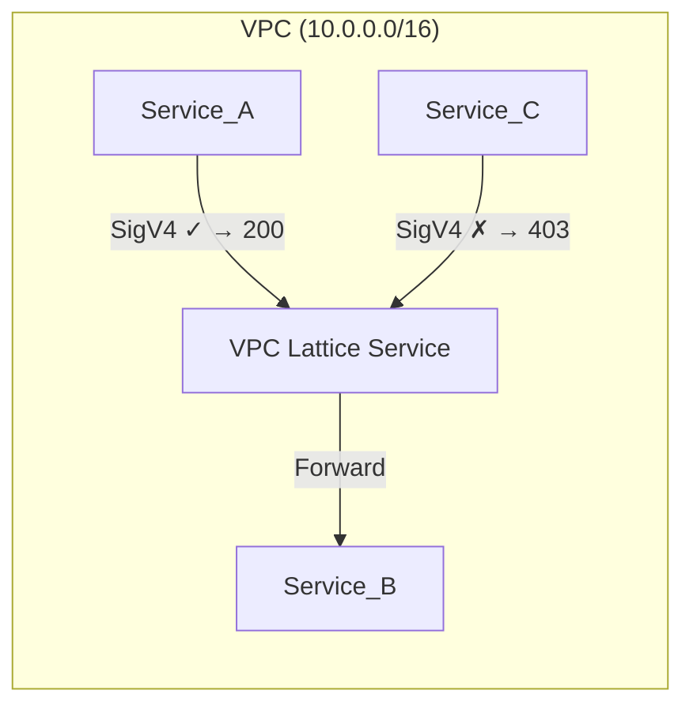

# VPC Lattice Service-to-Service Authentication Lab

A hands-on lab that teaches **VPC Lattice service-to-service authentication** using IAM authorization on AWS. Deploy a minimal environment from scratch and observe both successful and blocked inter-service communication — proving that authorization is enforced at the infrastructure level, not in application code.

## What You'll Learn

VPC Lattice uses a **dual authorization model** — a request succeeds only when BOTH:

1. The caller's identity-based IAM policy allows `vpc-lattice-svcs:Invoke`
2. The VPC Lattice auth policy on the target service permits the caller's principal

You'll deploy three ECS Fargate services and see this in action:

| Service | Role | Outcome |
|---------|------|---------|
| **Service_A** | Authorized caller | `200 OK` |
| **Service_B** | Protected target | Returns JSON to authorized callers |
| **Service_C** | Unauthorized caller | `403 AccessDeniedException` |

## Architecture



## Cost

**Estimated cost: < $0.15 for 1–2 hours.** Dominated by the VPC Lattice service hourly charge and one continuously-running Fargate task. Full breakdown in [docs/COST.md](docs/COST.md).

## Quick Start

1. Check the [Prerequisites](docs/PREREQUISITES.md)
2. Read the [Important Notes](docs/NOTICE.md) before deploying
3. Follow the [Lab Walkthrough](docs/WALKTHROUGH.md)

## Documentation

| Document | Description |
|----------|-------------|
| [Prerequisites](docs/PREREQUISITES.md) | Tools, permissions, and account requirements |
| [Important Notes](docs/NOTICE.md) | Usage guidance, scope, and responsibility |
| [Lab Walkthrough](docs/WALKTHROUGH.md) | Step-by-step deployment, testing, and explanation |
| [Cost Estimates](docs/COST.md) | Detailed cost breakdown and production cost levers |
| [FAQ & Troubleshooting](docs/FAQ.md) | Common issues and solutions |

## Project Structure

```
├── docs/                    # Documentation (start here)
│   ├── PREREQUISITES.md
│   ├── NOTICE.md
│   ├── WALKTHROUGH.md
│   ├── COST.md
│   └── FAQ.md
└── lab/                     # Lab code
    ├── phase1/              # Terraform: VPC, IAM, ECR, security groups
    ├── phase3/              # Terraform: ECS, VPC Lattice, auth policy
    └── services/            # Container source code
        ├── caller/          # Shared SigV4 caller (Service_A & Service_C)
        └── service_b/       # Flask target service
```

## License

See [LICENSE](LICENSE).
