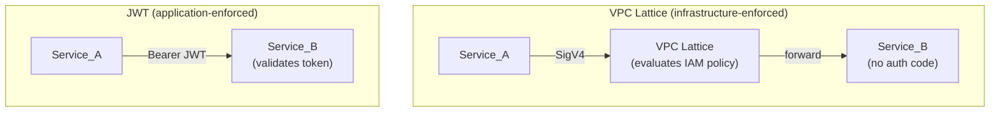

# Service-to-Service Authentication Labs

A collection of hands-on labs that teach **service-to-service authentication** on AWS. Each lab deploys the same three-service scenario and produces the same observable outcome — one caller is allowed, another is denied — but uses a different auth mechanism.

By comparing approaches side-by-side, you'll understand the trade-offs between infrastructure-enforced and application-enforced auth, and when to reach for each.

## The Scenario

Every lab deploys three ECS Fargate services:

| Service | Role | Outcome |
|---------|------|---------|
| **Service_A** | Authorised caller | `200 OK` |
| **Service_B** | Protected target | Returns JSON to authorised callers |
| **Service_C** | Unauthorised caller | `403 Forbidden` |

The application code is near-identical across labs. What changes is *how* and *where* the auth decision is made.

## Labs

| Lab | Auth Layer | Mechanism | Cost (1–2 hrs) |
|-----|-----------|-----------|----------------|
| [VPC Lattice](labs/vpc-lattice/) | Infrastructure | IAM roles + Lattice auth policy | < $0.15 |
| [JWT](labs/jwt/) | Application | Signed tokens + subject allowlist | < $0.10 |

Each lab has its own README with a full walkthrough, architecture diagram, and knowledge challenge.

## How They Compare



| Dimension | VPC Lattice | JWT |
|-----------|-------------|-----|
| **Identity** | IAM Task Role | JWT `sub` claim |
| **Enforcement point** | Before the request reaches the app | Inside the application |
| **Auth decision** | IAM policy + Lattice auth policy | Token validation + subject allowlist |
| **App code changes** | None | Each service implements validation |
| **Portability** | AWS-only | Any environment |
| **Key management** | Delegated to IAM | You own it (rotation, distribution) |
| **Direct cost** | Per-hour + per-GB Lattice charges | None beyond compute |

## Getting Started

1. Pick a lab from the table above
2. Check the shared [Prerequisites](docs/PREREQUISITES.md)
3. Read the [Important Notes](docs/NOTICE.md)
4. Follow the lab's README

Each lab is self-contained — you can run them independently or deploy both for comparison.

## Documentation

| Document | Description |
|----------|-------------|
| [Prerequisites](docs/PREREQUISITES.md) | Tools, permissions, and account requirements |
| [Important Notes](docs/NOTICE.md) | Usage guidance, scope, and responsibility |
| [Cost Estimates](docs/COST.md) | Detailed cost breakdown for all labs |
| [FAQ & Troubleshooting](docs/FAQ.md) | Common issues and solutions |

## Project Structure

```
├── docs/                        # Shared documentation
│   ├── PREREQUISITES.md
│   ├── NOTICE.md
│   ├── COST.md
│   └── FAQ.md
├── labs/
│   ├── vpc-lattice/             # Infrastructure-enforced auth (IAM + Lattice)
│   │   ├── phase1/             # Terraform: VPC, IAM, ECR, security groups
│   │   ├── phase3/             # Terraform: ECS, VPC Lattice, auth policy
│   │   ├── services/           # Container source code
│   │   └── README.md           # Full walkthrough
│   └── jwt/                     # Application-enforced auth (JWT tokens)
│       ├── phase1/             # Terraform: VPC, IAM, ECR, security groups
│       ├── phase3/             # Terraform: ECS cluster and services
│       ├── services/           # Container source code
│       ├── tests/              # Property-based tests
│       └── README.md           # Full walkthrough
└── README.md                    # ← you are here
```

## License

See [LICENSE](LICENSE).
