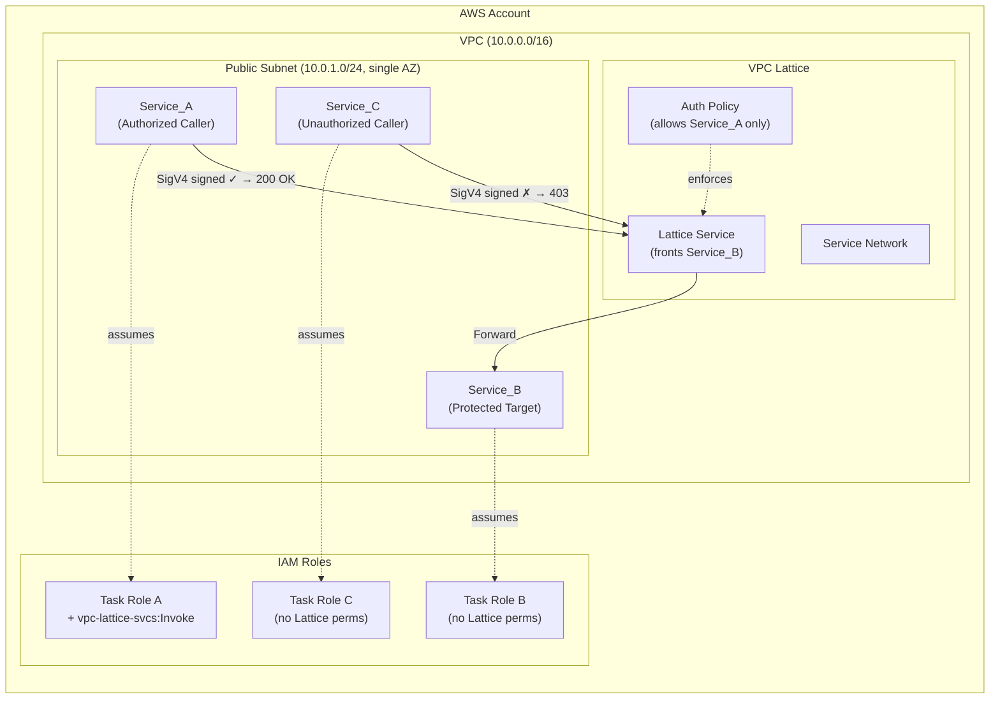
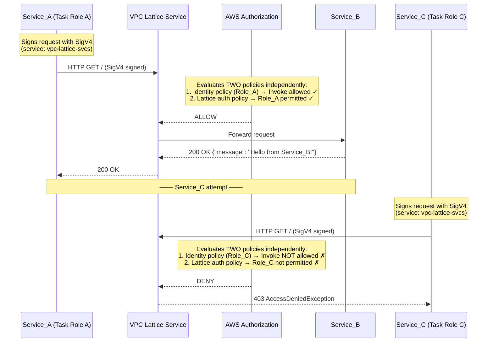
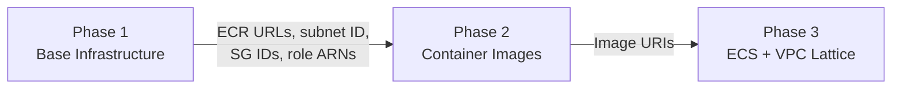
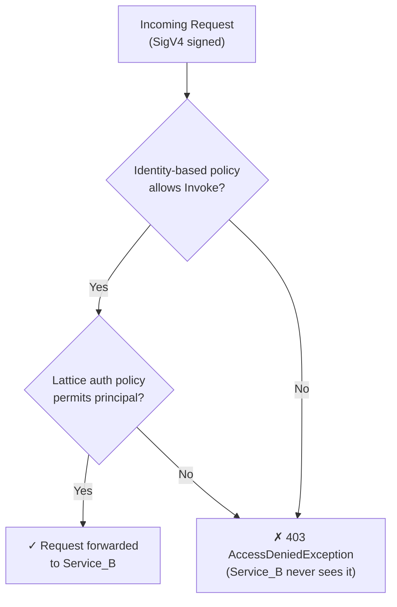

# Lab Walkthrough Guide

This guide walks you through deploying, testing, and understanding the VPC Lattice service-to-service authentication tutorial.

**Time**: 30–45 minutes | **Cost**: < $0.15 | **Prerequisites**: [PREREQUISITES.md](PREREQUISITES.md)

> Make sure you've read the [Important Notes](NOTICE.md) before deploying.

---

## Architecture Overview

Three ECS Fargate services communicate through VPC Lattice:



### Authorization Flow



---

## Deployment

The lab deploys in three phases:



---

### Phase 1: Deploy Base Infrastructure

Phase 1 creates the VPC, subnet, IAM roles, ECR repositories, and security groups.

```bash
cd lab/phase1
terraform init
terraform plan
terraform apply -auto-approve
```

Expected outputs after apply:

```
caller_ecr_repository_url = "<account_id>.dkr.ecr.us-east-1.amazonaws.com/lab/caller"
callers_security_group_id = "sg-xxxxxxxxxxxxxxxxx"
service_a_task_role_arn = "arn:aws:iam::<account_id>:role/lab-service-a-task-role"
service_b_ecr_repository_url = "<account_id>.dkr.ecr.us-east-1.amazonaws.com/lab/service-b"
service_b_security_group_id = "sg-xxxxxxxxxxxxxxxxx"
...
```

Capture outputs into shell variables:

```bash
export AWS_REGION="us-east-1"
export CALLER_ECR_URL=$(terraform output -raw caller_ecr_repository_url)
export SERVICE_B_ECR_URL=$(terraform output -raw service_b_ecr_repository_url)
export ACCOUNT_ID=$(echo $CALLER_ECR_URL | cut -d'.' -f1)
```

---

### Phase 2: Build and Push Container Images

#### Authenticate Docker to ECR

```bash
aws ecr get-login-password --region $AWS_REGION | docker login --username AWS --password-stdin $ACCOUNT_ID.dkr.ecr.$AWS_REGION.amazonaws.com
```

#### Build and push Service_B

```bash
docker build -t lab/service-b ./services/service_b/
docker tag lab/service-b:latest $SERVICE_B_ECR_URL:latest
docker push $SERVICE_B_ECR_URL:latest
```

#### Build and push the caller image

This image is shared by both Service_A and Service_C - the difference is purely IAM.

```bash
docker build -t lab/caller ./services/caller/
docker tag lab/caller:latest $CALLER_ECR_URL:latest
docker push $CALLER_ECR_URL:latest
```

---

### Phase 3: Deploy ECS Services and VPC Lattice

```bash
cd ../phase3
terraform init

terraform apply -auto-approve \
  -var="vpc_id=$(terraform -chdir=../phase1 output -raw vpc_id)" \
  -var="subnet_id=$(terraform -chdir=../phase1 output -raw subnet_id)" \
  -var="callers_security_group_id=$(terraform -chdir=../phase1 output -raw callers_security_group_id)" \
  -var="service_b_security_group_id=$(terraform -chdir=../phase1 output -raw service_b_security_group_id)" \
  -var="task_execution_role_arn=$(terraform -chdir=../phase1 output -raw task_execution_role_arn)" \
  -var="service_a_task_role_arn=$(terraform -chdir=../phase1 output -raw service_a_task_role_arn)" \
  -var="service_b_task_role_arn=$(terraform -chdir=../phase1 output -raw service_b_task_role_arn)" \
  -var="service_c_task_role_arn=$(terraform -chdir=../phase1 output -raw service_c_task_role_arn)" \
  -var="ecs_infrastructure_role_arn=$(terraform -chdir=../phase1 output -raw ecs_infrastructure_role_arn)" \
  -var="caller_image_uri=$CALLER_ECR_URL:latest" \
  -var="service_b_image_uri=$SERVICE_B_ECR_URL:latest"
```

Wait for Service_B to become healthy (1–2 minutes):

```bash
echo "Waiting for Service_B target group to become healthy..."
sleep 90
aws ecs list-tasks --cluster lab-cluster --service-name service-b --region $AWS_REGION
```

---

## Testing

Capture Phase 3 outputs:

```bash
export LATTICE_DNS=$(terraform output -raw lattice_service_dns)
export CLUSTER_NAME=$(terraform output -raw ecs_cluster_name)
export SUBNET_ID=$(terraform output -raw subnet_id)
export SG_ID=$(terraform output -raw callers_security_group_id)
```

### Test 1: Service_A → Service_B (Expected: 200 OK)

```bash
aws ecs run-task \
  --cluster $CLUSTER_NAME \
  --task-definition service-a \
  --network-configuration "awsvpcConfiguration={subnets=[$SUBNET_ID],securityGroups=[$SG_ID],assignPublicIp=ENABLED}" \
  --overrides "{\"containerOverrides\":[{\"name\":\"caller\",\"environment\":[{\"name\":\"LATTICE_ENDPOINT\",\"value\":\"$LATTICE_DNS\"},{\"name\":\"AWS_DEFAULT_REGION\",\"value\":\"$AWS_REGION\"}]}]}" \
  --launch-type FARGATE \
  --platform-version LATEST \
  --region $AWS_REGION
```

Wait and check logs:

```bash
sleep 30
aws logs tail /ecs/service-a --since 5m --region $AWS_REGION
```

**Expected output:**

```
Response status: 200
Response body: {"message": "Hello from Service_B!", "timestamp": "2024-..."}
```

### Test 2: Service_C → Service_B (Expected: 403)

```bash
aws ecs run-task \
  --cluster $CLUSTER_NAME \
  --task-definition service-c \
  --network-configuration "awsvpcConfiguration={subnets=[$SUBNET_ID],securityGroups=[$SG_ID],assignPublicIp=ENABLED}" \
  --overrides "{\"containerOverrides\":[{\"name\":\"caller\",\"environment\":[{\"name\":\"LATTICE_ENDPOINT\",\"value\":\"$LATTICE_DNS\"},{\"name\":\"AWS_DEFAULT_REGION\",\"value\":\"$AWS_REGION\"}]}]}" \
  --launch-type FARGATE \
  --platform-version LATEST \
  --region $AWS_REGION
```

Wait and check logs:

```bash
sleep 30
aws logs tail /ecs/service-c --since 5m --region $AWS_REGION
```

**Expected output:**

```
Response status: 403
Response body: AccessDeniedException
```

---

### Optional Experiment: Dual Authorization Proof

This proves that the identity-based IAM policy alone is insufficient - the Lattice auth policy must also permit the caller.

**Step 1**: Grant Service_C the Invoke permission:

```bash
aws iam put-role-policy \
  --role-name lab-service-c-task-role \
  --policy-name lattice-invoke-experiment \
  --policy-document "{\"Version\":\"2012-10-17\",\"Statement\":[{\"Effect\":\"Allow\",\"Action\":\"vpc-lattice-svcs:Invoke\",\"Resource\":\"*\"}]}" \
  --region $AWS_REGION
```

**Step 2**: Re-run Service_C (same command as Test 2 above).

**Expected**: Still `403 AccessDeniedException` - because the Lattice auth policy only permits Service_A's role.

**Step 3**: Clean up:

```bash
aws iam delete-role-policy \
  --role-name lab-service-c-task-role \
  --policy-name lattice-invoke-experiment \
  --region $AWS_REGION
```

---

## How It Works

### ECS Task Roles as Service Identity

Each ECS task assumes a unique IAM role at runtime. This role becomes the service's identity when making AWS API calls. The task role is automatically available inside the container via the container credential chain - no explicit credential management needed.

VPC Lattice uses this identity to evaluate authorization. The task role ARN is the principal that appears in both policy evaluations.

### The Dual Authorization Model



TWO independent policy evaluations must both allow:

1. **Caller-side**: Does the caller's IAM role have `vpc-lattice-svcs:Invoke` permission?
2. **Target-side**: Does the Lattice auth policy permit this specific principal?

If either denies, the request is blocked before reaching Service_B.

### SigV4 Signing

SigV4 signing proves the caller's identity to VPC Lattice:

1. Credentials come from the ECS task role (automatic via container credential chain)
2. Service name for signing: `vpc-lattice-svcs`
3. VPC Lattice verifies the signature and extracts the caller's IAM principal ARN
4. That ARN is evaluated against both authorization policies

### Comparison to GCP Cloud Run IAM

| Aspect | AWS (VPC Lattice) | GCP (Cloud Run) |
|--------|-------------------|-----------------|
| **Service identity** | ECS Task Role | Service Account |
| **Caller credential** | SigV4 signature | OIDC token |
| **Authorization** | Two policies (identity + auth policy) | Single IAM binding (`roles/run.invoker`) |
| **Enforcement** | VPC Lattice layer | Cloud Run ingress |

Both achieve the same goal: infrastructure-level service-to-service auth without authentication logic in application code.

### Suggested Extensions

| Extension | Description |
|-----------|-------------|
| JWT-based authentication | For non-AWS callers that cannot use SigV4 |
| mTLS | Transport-level mutual TLS |
| VPC endpoints | Private networking without public IPs |
| Custom domain names | Friendly DNS for Lattice services |
| Multi-AZ deployment | Production resilience |
| CloudTrail logging | Audit trail of Invoke events |
| Scoped IAM policies | Replace `Resource: "*"` with specific ARNs |
| Service Network sharing | Cross-account communication via AWS RAM |

---

## Cleanup

Destroy all resources promptly to avoid ongoing charges.

### Step 1: Destroy Phase 3

```bash
cd lab/phase3

terraform destroy -auto-approve \
  -var="vpc_id=$(terraform -chdir=../phase1 output -raw vpc_id)" \
  -var="subnet_id=$(terraform -chdir=../phase1 output -raw subnet_id)" \
  -var="callers_security_group_id=$(terraform -chdir=../phase1 output -raw callers_security_group_id)" \
  -var="service_b_security_group_id=$(terraform -chdir=../phase1 output -raw service_b_security_group_id)" \
  -var="task_execution_role_arn=$(terraform -chdir=../phase1 output -raw task_execution_role_arn)" \
  -var="service_a_task_role_arn=$(terraform -chdir=../phase1 output -raw service_a_task_role_arn)" \
  -var="service_b_task_role_arn=$(terraform -chdir=../phase1 output -raw service_b_task_role_arn)" \
  -var="service_c_task_role_arn=$(terraform -chdir=../phase1 output -raw service_c_task_role_arn)" \
  -var="ecs_infrastructure_role_arn=$(terraform -chdir=../phase1 output -raw ecs_infrastructure_role_arn)" \
  -var="caller_image_uri=$CALLER_ECR_URL:latest" \
  -var="service_b_image_uri=$SERVICE_B_ECR_URL:latest"
```

> If you've lost shell variables: `export CALLER_ECR_URL=$(terraform -chdir=../phase1 output -raw caller_ecr_repository_url)` and similar.

### Step 2: Destroy Phase 1

```bash
cd ../phase1
terraform destroy -auto-approve
```

### Step 3: Verify

```bash
aws ecs list-clusters --region $AWS_REGION
aws vpc-lattice list-services --region $AWS_REGION
aws ec2 describe-vpcs --filters "Name=tag:Name,Values=lab-vpc" --region $AWS_REGION
aws ecr describe-repositories --region $AWS_REGION
```

All should return empty results for lab resources.
