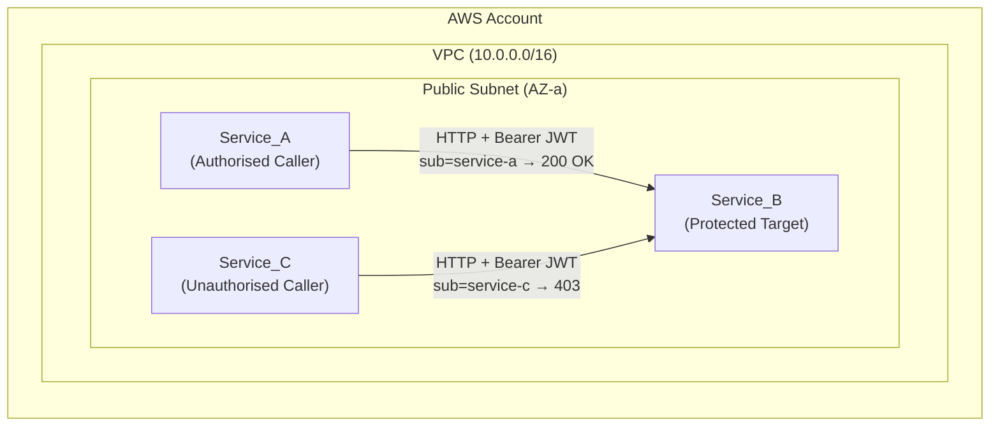
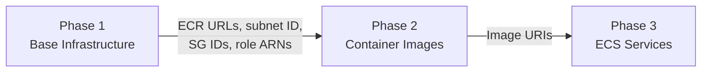
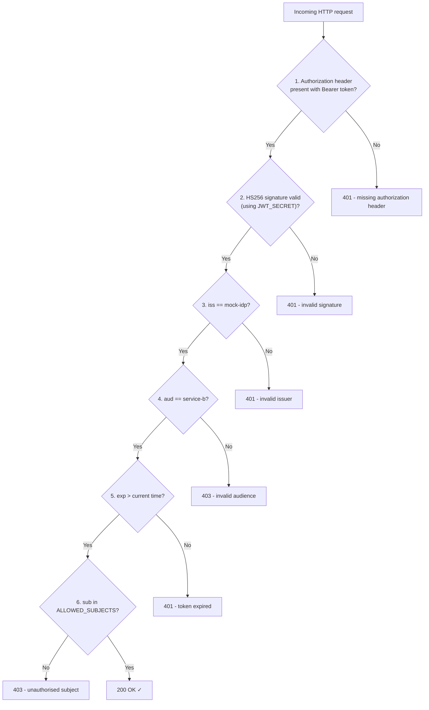

# JWT Service-to-Service Authentication Lab

This lab teaches application-layer service-to-service authentication using JWT (JSON Web Tokens). Three ECS Fargate services demonstrate both successful and blocked inter-service communication — identical observable outcomes to the [VPC Lattice lab](../vpc-lattice/), but with auth enforced by the application rather than infrastructure.

**Time**: 30–45 minutes | **Cost**: < $0.10 | **Prerequisites**: see below

> ⚠️ **Lab simplification**: All services share the same HMAC signing key via environment variable. This allows callers to mint their own tokens — a pattern that would be unacceptable in production. See the [Comparison](#comparison-vpc-lattice-vs-jwt-auth) section for details.

---

## Architecture



**How it works**: Service_A and Service_C both generate valid, correctly-signed JWTs. The only difference is the `sub` (subject) claim. Service_B validates the token and checks whether the subject is in its allowed list. Service_A (`service-a`) is allowed; Service_C (`service-c`) is not.

This demonstrates the **authentication vs authorization distinction**: Service_C proves its identity (valid token) but lacks authorization (subject not permitted).

---

## Prerequisites

| Tool | Minimum Version | Purpose |
|------|----------------|---------|
| [Terraform](https://developer.hashicorp.com/terraform/downloads) | >= 1.14.0 | Infrastructure deployment |
| [AWS CLI](https://docs.aws.amazon.com/cli/latest/userguide/getting-started-install.html) | v2 | AWS operations, ECR login, ECS run-task |
| [Docker](https://docs.docker.com/get-docker/) | Latest stable | Build and push container images |
| [Python](https://www.python.org/downloads/) | 3.9+ | Running property-based tests locally (optional) |

You also need an AWS account with permissions for VPC, ECS, IAM, ECR, and CloudWatch Logs. For a learning environment, `AdministratorAccess` avoids permission issues.

---

## Deployment

The lab deploys in three phases:



---

### Phase 1: Deploy Base Infrastructure

Phase 1 creates the VPC, subnet, IAM roles, ECR repositories, and security groups.

```bash
cd labs/jwt/phase1
terraform init
terraform plan
terraform apply -auto-approve
```

Expected outputs after apply:

```
caller_ecr_repository_url = "<account_id>.dkr.ecr.us-east-1.amazonaws.com/jwt-lab/caller"
service_b_ecr_repository_url = "<account_id>.dkr.ecr.us-east-1.amazonaws.com/jwt-lab/service-b"
callers_security_group_id = "sg-xxxxxxxxxxxxxxxxx"
service_b_security_group_id = "sg-xxxxxxxxxxxxxxxxx"
subnet_id = "subnet-xxxxxxxxxxxxxxxxx"
task_execution_role_arn = "arn:aws:iam::<account_id>:role/jwt-lab-task-execution-role"
...
```

Capture outputs into shell variables:

```bash
export AWS_REGION="us-east-1"
export CALLER_ECR_URL=$(terraform output -raw caller_ecr_repository_url)
export SERVICE_B_ECR_URL=$(terraform output -raw service_b_ecr_repository_url)
export ACCOUNT_ID=$(echo $CALLER_ECR_URL | cut -d'.' -f1)
```

---

### Phase 2: Build and Push Container Images

Navigate back to the `labs/jwt/` directory:

```bash
cd ..
```

#### Authenticate Docker to ECR

```bash
aws ecr get-login-password --region $AWS_REGION | docker login --username AWS --password-stdin $ACCOUNT_ID.dkr.ecr.$AWS_REGION.amazonaws.com
```

#### Build and push Service_B

```bash
docker build -t jwt-lab/service-b ./services/service_b/
docker tag jwt-lab/service-b:latest $SERVICE_B_ECR_URL:latest
docker push $SERVICE_B_ECR_URL:latest
```

#### Build and push the caller image

This image is shared by both Service_A and Service_C — the difference is the `CALLER_SUBJECT` environment variable set in the task definition.

```bash
docker build -t jwt-lab/caller ./services/caller/
docker tag jwt-lab/caller:latest $CALLER_ECR_URL:latest
docker push $CALLER_ECR_URL:latest
```

---

### Phase 3: Deploy ECS Services

```bash
cd phase3
terraform init

terraform apply -auto-approve \
  -var="subnet_id=$(terraform -chdir=../phase1 output -raw subnet_id)" \
  -var="callers_security_group_id=$(terraform -chdir=../phase1 output -raw callers_security_group_id)" \
  -var="service_b_security_group_id=$(terraform -chdir=../phase1 output -raw service_b_security_group_id)" \
  -var="task_execution_role_arn=$(terraform -chdir=../phase1 output -raw task_execution_role_arn)" \
  -var="service_a_task_role_arn=$(terraform -chdir=../phase1 output -raw service_a_task_role_arn)" \
  -var="service_b_task_role_arn=$(terraform -chdir=../phase1 output -raw service_b_task_role_arn)" \
  -var="service_c_task_role_arn=$(terraform -chdir=../phase1 output -raw service_c_task_role_arn)" \
  -var="caller_image_uri=$CALLER_ECR_URL:latest" \
  -var="service_b_image_uri=$SERVICE_B_ECR_URL:latest" \
  -var="jwt_secret=my-super-secret-key-for-lab"
```

Wait for Service_B to start (1–2 minutes):

```bash
echo "Waiting for Service_B to start..."
sleep 90
aws ecs list-tasks --cluster jwt-lab-cluster --service-name service-b --region $AWS_REGION
```

#### Get Service_B's IP address

Service_B runs as a Fargate task with a public IP. You need this IP to tell callers where to send requests.

```bash
TASK_ARN=$(aws ecs list-tasks --cluster jwt-lab-cluster \
  --service-name service-b --query 'taskArns[0]' --output text --region $AWS_REGION)

ENI_ID=$(aws ecs describe-tasks --cluster jwt-lab-cluster \
  --tasks $TASK_ARN \
  --query 'tasks[0].attachments[0].details[?name==`networkInterfaceId`].value' \
  --output text --region $AWS_REGION)

SERVICE_B_IP=$(aws ec2 describe-network-interfaces \
  --network-interface-ids $ENI_ID \
  --query 'NetworkInterfaces[0].Association.PublicIp' \
  --output text --region $AWS_REGION)

echo "Service_B URL: http://$SERVICE_B_IP:5000"
```

Save this for the testing phase:

```bash
export SERVICE_B_URL="http://$SERVICE_B_IP:5000"
```

---

## Testing

Capture Phase 3 outputs:

```bash
export CLUSTER_NAME=$(terraform output -raw ecs_cluster_name)
export SUBNET_ID=$(terraform output -raw subnet_id)
export SG_ID=$(terraform output -raw callers_security_group_id)
```

### Test 1: Service_A → Service_B (Expected: 200 OK)

Service_A generates a JWT with `sub=service-a`, which is in Service_B's allowed subjects list.

```bash
aws ecs run-task \
  --cluster $CLUSTER_NAME \
  --task-definition service-a \
  --network-configuration "awsvpcConfiguration={subnets=[$SUBNET_ID],securityGroups=[$SG_ID],assignPublicIp=ENABLED}" \
  --overrides "{\"containerOverrides\":[{\"name\":\"caller\",\"environment\":[{\"name\":\"SERVICE_B_URL\",\"value\":\"$SERVICE_B_URL\"}]}]}" \
  --launch-type FARGATE \
  --platform-version LATEST \
  --region $AWS_REGION
```

Wait and check logs:

```bash
sleep 30
aws logs tail /ecs/jwt-service-a --since 5m --region $AWS_REGION
```

**Expected output:**

```
AUTH SUCCESS: status=200 body={"message": "Hello from Service_B!", "subject": "service-a", "timestamp": "2025-..."}
```

### Test 2: Service_C → Service_B (Expected: 403 Forbidden)

Service_C generates a JWT with `sub=service-c`. The token is valid (correct signature, non-expired, correct audience) but `service-c` is not in Service_B's allowed subjects list.

```bash
aws ecs run-task \
  --cluster $CLUSTER_NAME \
  --task-definition service-c \
  --network-configuration "awsvpcConfiguration={subnets=[$SUBNET_ID],securityGroups=[$SG_ID],assignPublicIp=ENABLED}" \
  --overrides "{\"containerOverrides\":[{\"name\":\"caller\",\"environment\":[{\"name\":\"SERVICE_B_URL\",\"value\":\"$SERVICE_B_URL\"}]}]}" \
  --launch-type FARGATE \
  --platform-version LATEST \
  --region $AWS_REGION
```

Wait and check logs:

```bash
sleep 30
aws logs tail /ecs/jwt-service-c --since 5m --region $AWS_REGION
```

**Expected output:**

```
AUTH DENIED: status=403 body={"error": "unauthorised subject", "subject": "service-c"}
```

---

## How It Works

Now that you've seen Service_A succeed and Service_C fail, let's trace exactly why — by following the token through Service_B's validation logic.

### Service_B's Validation Pipeline

Every request to Service_B passes through five checks, in order. A failure at any step short-circuits the rest:



### Tracing Service_A (success)

Service_A generates this JWT payload:

```json
{"iss": "mock-idp", "sub": "service-a", "aud": "service-b", "exp": <future>}
```

Walking through the checks:

| Step | Check | Result |
|------|-------|--------|
| 1 | Authorization header present? | ✓ `Bearer <token>` |
| 2 | Signature valid (same JWT_SECRET)? | ✓ Both share the key |
| 3 | `iss` == `mock-idp`? | ✓ Matches EXPECTED_ISSUER |
| 4 | `aud` == `service-b`? | ✓ Correct audience |
| 5 | `exp` > now? | ✓ Token generated with 5-min window |
| 6 | `sub` in ALLOWED_SUBJECTS? | ✓ `service-a` is in `["service-a"]` |

All six checks pass → **200 OK**.

### Tracing Service_C (failure)

Service_C generates this JWT payload:

```json
{"iss": "mock-idp", "sub": "service-c", "aud": "service-b", "exp": <future>}
```

Walking through the same checks:

| Step | Check | Result |
|------|-------|--------|
| 1 | Authorization header present? | ✓ |
| 2 | Signature valid? | ✓ Same shared key |
| 3 | `iss` == `mock-idp`? | ✓ |
| 4 | `aud` == `service-b`? | ✓ |
| 5 | `exp` > now? | ✓ |
| 6 | `sub` in ALLOWED_SUBJECTS? | ✗ `service-c` is NOT in `["service-a"]` |

Service_C passes authentication (steps 1–5 prove it is who it claims to be) but fails authorization (step 6 — it's not permitted). This is the key insight: **a valid identity does not imply access**.

### The difference from VPC Lattice

In the VPC Lattice lab, Service_C fails because:
1. Its IAM role lacks `vpc-lattice-svcs:Invoke` permission (identity policy gate)
2. The Lattice auth policy doesn't list its role ARN (resource policy gate)

In the JWT lab, Service_C fails because:
- Its subject claim (`service-c`) is not in Service_B's allowed subjects list

Both enforce the same concept — identity-based access control — but at different layers. VPC Lattice enforces it in infrastructure before the request reaches the application. JWT enforces it inside the application code.

---

## Knowledge Challenge

You've seen Service_A succeed and Service_C fail. You understand why.

**Challenge: can you update the solution so Service_C is also allowed to call Service_B?**

Think about what you've just traced. There's only one gate that blocked Service_C — and only one place that gate is configured.

Give it a go before reading the hint below.

<details>
<summary><strong>Hint</strong></summary>

The `ALLOWED_SUBJECTS` environment variable in Service_B's task definition controls who gets through step 6. It's currently set to `service-a`.

You have two options:

**Option A — Update via Terraform (persistent)**

Edit `labs/jwt/phase3/ecs.tf` and change the `ALLOWED_SUBJECTS` value in Service_B's container definition:

```hcl
{
  name  = "ALLOWED_SUBJECTS"
  value = "service-a,service-c"
}
```

Then re-apply:

```bash
terraform apply -auto-approve \
  -var="subnet_id=$(terraform -chdir=../phase1 output -raw subnet_id)" \
  -var="callers_security_group_id=$(terraform -chdir=../phase1 output -raw callers_security_group_id)" \
  -var="service_b_security_group_id=$(terraform -chdir=../phase1 output -raw service_b_security_group_id)" \
  -var="task_execution_role_arn=$(terraform -chdir=../phase1 output -raw task_execution_role_arn)" \
  -var="service_a_task_role_arn=$(terraform -chdir=../phase1 output -raw service_a_task_role_arn)" \
  -var="service_b_task_role_arn=$(terraform -chdir=../phase1 output -raw service_b_task_role_arn)" \
  -var="service_c_task_role_arn=$(terraform -chdir=../phase1 output -raw service_c_task_role_arn)" \
  -var="caller_image_uri=$CALLER_ECR_URL:latest" \
  -var="service_b_image_uri=$SERVICE_B_ECR_URL:latest" \
  -var="jwt_secret=my-super-secret-key-for-lab"
```

ECS will deploy a new Service_B task with the updated environment. Wait for it to stabilise, get the new IP, then re-run Service_C.

**Option B — Quick test via ECS Console (temporary)**

Stop the current Service_B task and update the service's task definition to include `service-c` in `ALLOWED_SUBJECTS`. This is faster for experimentation but won't persist if you re-apply Terraform.

**Expected result after the fix:**

```
AUTH SUCCESS: status=200 body={"message": "Hello from Service_B!", "subject": "service-c", "timestamp": "2025-..."}
```

</details>

---

### Distinguishing Auth Failures from Network Errors

If you see `NETWORK ERROR: Connection timed out` or `NETWORK ERROR: Connection refused` instead of `AUTH SUCCESS` or `AUTH DENIED`, the issue is network connectivity — not JWT auth. Check:

1. Service_B task is in RUNNING state
2. The `SERVICE_B_URL` IP is correct (re-run the IP lookup commands above)
3. Security groups allow callers to reach Service_B on port 5000

Auth responses always show `AUTH SUCCESS` or `AUTH DENIED` with an HTTP status code. Network errors always show `NETWORK ERROR` with a connection-level message.

