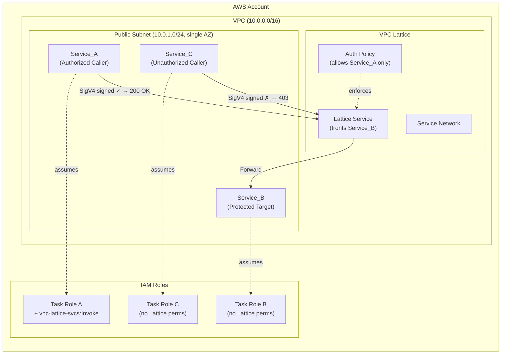
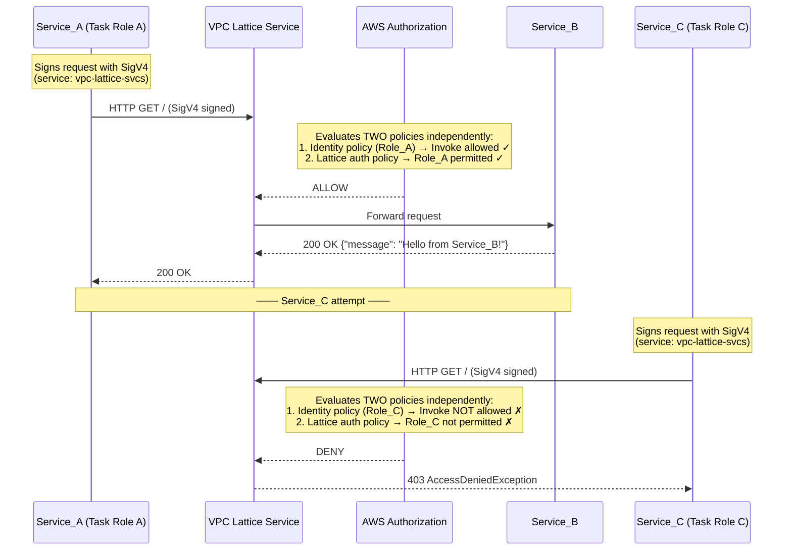
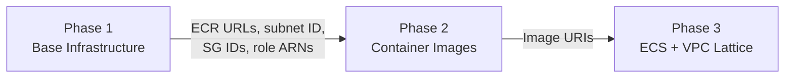
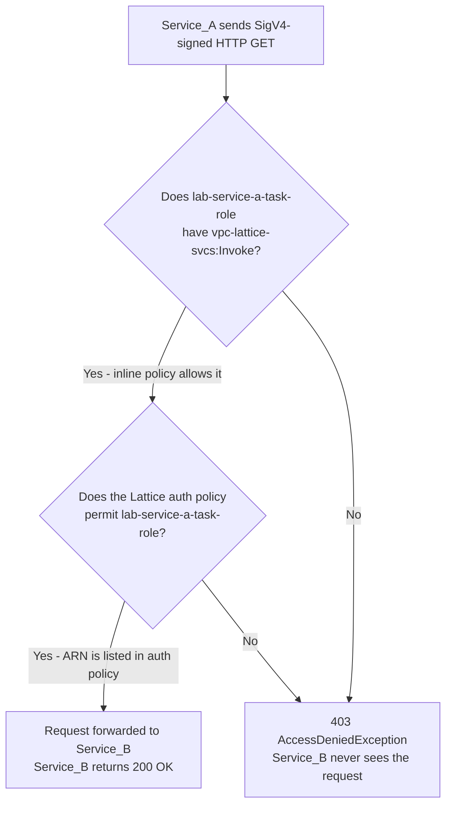
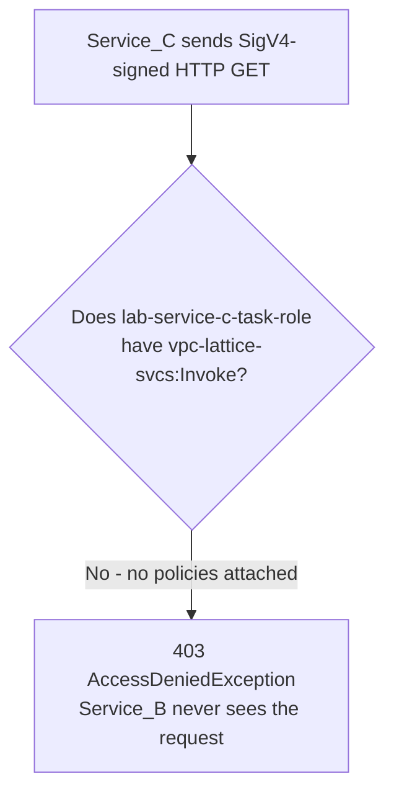

# VPC Lattice Service-to-Service Authentication Lab

This lab teaches **infrastructure-enforced service-to-service authentication** using VPC Lattice and IAM on AWS. You'll deploy a minimal environment from scratch and observe both successful and blocked inter-service communication — proving that authorization is enforced at the infrastructure level, not in application code.

**Time**: 30–45 minutes | **Cost**: < $0.15 | **Prerequisites**: [Prerequisites](../../docs/PREREQUISITES.md)

> Make sure you've read the [Important Notes](../../docs/NOTICE.md) before deploying.

---

## Environment

This tutorial is written for **AWS CloudShell**. It has the AWS CLI and Docker pre-installed, your credentials are automatically available, and there's nothing to configure before you start.

To open CloudShell, click the terminal icon in the top navigation bar of the AWS Console, or go to [console.aws.amazon.com/cloudshell](https://console.aws.amazon.com/cloudshell). Make sure you open it in the same region you plan to deploy to.

Terraform isn't pre-installed in CloudShell, so you'll need to add it. Run this once per CloudShell session:

```bash
sudo dnf install -y dnf-plugins-core
sudo dnf config-manager --add-repo https://rpm.releases.hashicorp.com/AmazonLinux/hashicorp.repo
sudo dnf -y install terraform
```

CloudShell's home directory has limited disk space (1 GB), so redirect the Terraform plugin cache to `/tmp` before running any `terraform init`:

```bash
export TF_PLUGIN_CACHE_DIR="/tmp/tf-plugin-cache"
mkdir -p $TF_PLUGIN_CACHE_DIR
```

> **Using a different environment?** The commands in this guide should work in any bash-compatible shell with the AWS CLI, Docker, and Terraform installed. You'll need to handle credential configuration and any environment differences yourself - but you probably already know that.

---

## Architecture Overview

Three ECS Fargate services communicate through VPC Lattice:



### Authorization Flow



---

## Deployment

The lab deploys in three phases:



---

### Phase 1: Deploy Base Infrastructure

Phase 1 creates the VPC, subnet, IAM roles, ECR repositories, and security groups.

```bash
cd labs/vpc-lattice/phase1
terraform init
terraform plan
terraform apply -auto-approve
```

Expected outputs after apply:

```
caller_ecr_repository_url = "<account_id>.dkr.ecr.us-east-1.amazonaws.com/lab/caller"
callers_security_group_id = "sg-xxxxxxxxxxxxxxxxx"
service_a_task_role_arn = "arn:aws:iam::<account_id>:role/lab-service-a-task-role"
service_b_ecr_repository_url = "<account_id>.dkr.ecr.us-east-1.amazonaws.com/lab/service-b"
service_b_security_group_id = "sg-xxxxxxxxxxxxxxxxx"
...
```

Capture outputs into shell variables:

```bash
export AWS_REGION="us-east-1"
export CALLER_ECR_URL=$(terraform output -raw caller_ecr_repository_url)
export SERVICE_B_ECR_URL=$(terraform output -raw service_b_ecr_repository_url)
export ACCOUNT_ID=$(echo $CALLER_ECR_URL | cut -d'.' -f1)
```

---

### Phase 2: Build and Push Container Images

#### Authenticate Docker to ECR

First, navigate back to the `lab/` directory:

```bash
cd ..
```

Then authenticate Docker to ECR:

```bash
aws ecr get-login-password --region $AWS_REGION | docker login --username AWS --password-stdin $ACCOUNT_ID.dkr.ecr.$AWS_REGION.amazonaws.com
```

#### Build and push Service_B

```bash
docker build -t lab/service-b ./services/service_b/
docker tag lab/service-b:latest $SERVICE_B_ECR_URL:latest
docker push $SERVICE_B_ECR_URL:latest
```

#### Build and push the caller image

This image is shared by both Service_A and Service_C - the difference is purely IAM.

```bash
docker build -t lab/caller ./services/caller/
docker tag lab/caller:latest $CALLER_ECR_URL:latest
docker push $CALLER_ECR_URL:latest
```

---

### Phase 3: Deploy ECS Services and VPC Lattice

```bash
cd phase3
terraform init

terraform apply -auto-approve \
  -var="vpc_id=$(terraform -chdir=../phase1 output -raw vpc_id)" \
  -var="subnet_id=$(terraform -chdir=../phase1 output -raw subnet_id)" \
  -var="callers_security_group_id=$(terraform -chdir=../phase1 output -raw callers_security_group_id)" \
  -var="service_b_security_group_id=$(terraform -chdir=../phase1 output -raw service_b_security_group_id)" \
  -var="task_execution_role_arn=$(terraform -chdir=../phase1 output -raw task_execution_role_arn)" \
  -var="service_a_task_role_arn=$(terraform -chdir=../phase1 output -raw service_a_task_role_arn)" \
  -var="service_b_task_role_arn=$(terraform -chdir=../phase1 output -raw service_b_task_role_arn)" \
  -var="service_c_task_role_arn=$(terraform -chdir=../phase1 output -raw service_c_task_role_arn)" \
  -var="ecs_infrastructure_role_arn=$(terraform -chdir=../phase1 output -raw ecs_infrastructure_role_arn)" \
  -var="caller_image_uri=$CALLER_ECR_URL:latest" \
  -var="service_b_image_uri=$SERVICE_B_ECR_URL:latest"
```

Wait for Service_B to become healthy (1–2 minutes):

```bash
echo "Waiting for Service_B target group to become healthy..."
sleep 90
aws ecs list-tasks --cluster lab-cluster --service-name service-b --region $AWS_REGION
```

---

## Testing

Capture Phase 3 outputs:

```bash
export LATTICE_DNS=$(terraform output -raw lattice_service_dns)
export CLUSTER_NAME=$(terraform output -raw ecs_cluster_name)
export SUBNET_ID=$(terraform output -raw subnet_id)
export SG_ID=$(terraform output -raw callers_security_group_id)
```

### Test 1: Service_A → Service_B (Expected: 200 OK)

```bash
aws ecs run-task \
  --cluster $CLUSTER_NAME \
  --task-definition service-a \
  --network-configuration "awsvpcConfiguration={subnets=[$SUBNET_ID],securityGroups=[$SG_ID],assignPublicIp=ENABLED}" \
  --overrides "{\"containerOverrides\":[{\"name\":\"caller\",\"environment\":[{\"name\":\"LATTICE_ENDPOINT\",\"value\":\"$LATTICE_DNS\"},{\"name\":\"AWS_DEFAULT_REGION\",\"value\":\"$AWS_REGION\"}]}]}" \
  --launch-type FARGATE \
  --platform-version LATEST \
  --region $AWS_REGION
```

Wait and check logs:

```bash
sleep 30
aws logs tail /ecs/service-a --since 5m --region $AWS_REGION
```

**Expected output:**

```
Response status: 200
Response body: {"message": "Hello from Service_B!", "timestamp": "2024-..."}
```

### Test 2: Service_C → Service_B (Expected: 403)

```bash
aws ecs run-task \
  --cluster $CLUSTER_NAME \
  --task-definition service-c \
  --network-configuration "awsvpcConfiguration={subnets=[$SUBNET_ID],securityGroups=[$SG_ID],assignPublicIp=ENABLED}" \
  --overrides "{\"containerOverrides\":[{\"name\":\"caller\",\"environment\":[{\"name\":\"LATTICE_ENDPOINT\",\"value\":\"$LATTICE_DNS\"},{\"name\":\"AWS_DEFAULT_REGION\",\"value\":\"$AWS_REGION\"}]}]}" \
  --launch-type FARGATE \
  --platform-version LATEST \
  --region $AWS_REGION
```

Wait and check logs:

```bash
sleep 30
aws logs tail /ecs/service-c --since 5m --region $AWS_REGION
```

**Expected output:**

```
Response status: 403
Response body: AccessDeniedException
```

---

### Optional Experiment: Dual Authorization Proof

This proves that the identity-based IAM policy alone is insufficient - the Lattice auth policy must also permit the caller.

**Step 1**: Grant Service_C the Invoke permission:

```bash
aws iam put-role-policy \
  --role-name lab-service-c-task-role \
  --policy-name lattice-invoke-experiment \
  --policy-document "{\"Version\":\"2012-10-17\",\"Statement\":[{\"Effect\":\"Allow\",\"Action\":\"vpc-lattice-svcs:Invoke\",\"Resource\":\"*\"}]}" \
  --region $AWS_REGION
```

**Step 2**: Re-run Service_C (same command as Test 2 above).

**Expected**: Still `403 AccessDeniedException` - because the Lattice auth policy only permits Service_A's role.

**Step 3**: Clean up:

```bash
aws iam delete-role-policy \
  --role-name lab-service-c-task-role \
  --policy-name lattice-invoke-experiment \
  --region $AWS_REGION
```

---

## How It Works

Now that you've seen the results, let's walk through exactly why Service_A succeeded and Service_C failed - using the AWS Console to inspect the real resources.

### Step 1 - Understand service identity: look at the ECS task roles

Every ECS Fargate task assumes an IAM role at runtime. That role is the task's identity - it's what AWS uses to answer the question "who is making this request?"

Open the [IAM Console - Roles](https://console.aws.amazon.com/iam/home#/roles) and search for `lab-`. You'll see four roles:

| Role | Purpose |
|------|---------|
| `lab-task-execution-role` | Used by the ECS agent to pull images and write logs - not the application |
| `lab-service-a-task-role` | Assumed by Service_A's container at runtime |
| `lab-service-b-task-role` | Assumed by Service_B's container at runtime |
| `lab-service-c-task-role` | Assumed by Service_C's container at runtime |

Click on `lab-service-a-task-role` and look at the **Permissions** tab. You'll see an inline policy that allows:

```json
{
  "Effect": "Allow",
  "Action": "vpc-lattice-svcs:Invoke",
  "Resource": "*"
}
```

Now click on `lab-service-c-task-role`. Notice the **Permissions** tab is empty - no policies attached. Service_C has no permission to invoke anything on VPC Lattice.

This is the first gate. Service_A can attempt a VPC Lattice call; Service_C cannot.

---

### Step 2 - Understand the auth policy: look at the Lattice service

Having the identity-based permission is necessary, but not sufficient. VPC Lattice also evaluates a resource-based auth policy on the target service itself.

Open the [VPC Console](https://console.aws.amazon.com/vpcconsole/home) and click **Lattice services** in the left nav. Click on `lab-service-b`.

On the service detail page, click the **Access** tab. You'll see the auth policy:

```json
{
  "Version": "2012-10-17",
  "Statement": [
    {
      "Effect": "Allow",
      "Principal": {
        "AWS": "arn:aws:iam::<account_id>:role/lab-service-a-task-role"
      },
      "Action": "vpc-lattice-svcs:Invoke",
      "Resource": "*"
    }
  ]
}
```

This policy names exactly one principal: `lab-service-a-task-role`. Anyone not listed is implicitly denied. Service_C's role ARN does not appear here, so even if Service_C somehow passed the first gate, it would be blocked here.

Also note the **Auth type** field at the top of the page is set to `AWS_IAM`. This is what activates policy enforcement - without it, the auth policy is ignored entirely.

---

### Step 3 - Trace why Service_A succeeds

When Service_A makes a request to the Lattice service DNS endpoint, AWS evaluates two questions in sequence:



Both checks pass for Service_A. The request reaches Service_B, which returns its JSON response. Service_B has no idea who called it - it just handles the HTTP request.

---

### Step 4 - Trace why Service_C fails

Service_C uses identical application code to Service_A. The only difference is the IAM role it assumes. Follow the same flow:



Service_C fails at the very first gate. It doesn't even reach the auth policy evaluation. The 403 comes back fast (under a second) because VPC Lattice rejects it immediately - there's no network timeout, no connection to Service_B, nothing.

This is the key insight: **the application code is identical, the container image is identical, the network path is identical. The only thing that differs is the IAM role - and that's enough to completely control access.**

---

### Knowledge check

You've seen Service_A succeed and Service_C fail. You understand why.

**Challenge: can you update the solution to allow Service_C to connect to Service_B?**

Think about what you'd need to change based on what you've just seen in the Console. There are two things that need to be true for a caller to succeed - you'll need to address both of them.

Give it a go using the AWS Console before looking at any hints.

> Stuck? A step-by-step console walkthrough is available in [HINT.md](HINT.md).

---

### Why this matters: no application code changes needed

Notice that Service_B's `app.py` contains zero authentication logic. It doesn't inspect headers, validate tokens, or check caller identity. It just returns a JSON response. Authorization is entirely handled by the infrastructure layer - VPC Lattice evaluates the policies before the request ever reaches the container.

This is the core pattern: **define who can call what in IAM and Lattice policies, not in application code.**

---

### Comparison to GCP Cloud Run IAM

| Aspect | AWS (VPC Lattice) | GCP (Cloud Run) |
|--------|-------------------|-----------------|
| **Service identity** | ECS Task Role | Service Account |
| **Caller credential** | SigV4 signature | OIDC token |
| **Authorization** | Two policies (identity + auth policy) | Single IAM binding (`roles/run.invoker`) |
| **Enforcement** | VPC Lattice layer | Cloud Run ingress |

Both achieve the same goal: infrastructure-level service-to-service auth without authentication logic in application code.

### Suggested Extensions

| Extension | Description |
|-----------|-------------|
| JWT-based authentication | For non-AWS callers that cannot use SigV4 |
| mTLS | Transport-level mutual TLS |
| VPC endpoints | Private networking without public IPs |
| Custom domain names | Friendly DNS for Lattice services |
| Multi-AZ deployment | Production resilience |
| CloudTrail logging | Audit trail of Invoke events |
| Scoped IAM policies | Replace `Resource: "*"` with specific ARNs |
| Service Network sharing | Cross-account communication via AWS RAM |

---

## Cleanup

Destroy all resources promptly to avoid ongoing charges.

### Step 1: Destroy Phase 3

```bash
cd labs/vpc-lattice/phase3

terraform destroy -auto-approve \
  -var="vpc_id=$(terraform -chdir=../phase1 output -raw vpc_id)" \
  -var="subnet_id=$(terraform -chdir=../phase1 output -raw subnet_id)" \
  -var="callers_security_group_id=$(terraform -chdir=../phase1 output -raw callers_security_group_id)" \
  -var="service_b_security_group_id=$(terraform -chdir=../phase1 output -raw service_b_security_group_id)" \
  -var="task_execution_role_arn=$(terraform -chdir=../phase1 output -raw task_execution_role_arn)" \
  -var="service_a_task_role_arn=$(terraform -chdir=../phase1 output -raw service_a_task_role_arn)" \
  -var="service_b_task_role_arn=$(terraform -chdir=../phase1 output -raw service_b_task_role_arn)" \
  -var="service_c_task_role_arn=$(terraform -chdir=../phase1 output -raw service_c_task_role_arn)" \
  -var="ecs_infrastructure_role_arn=$(terraform -chdir=../phase1 output -raw ecs_infrastructure_role_arn)" \
  -var="caller_image_uri=$CALLER_ECR_URL:latest" \
  -var="service_b_image_uri=$SERVICE_B_ECR_URL:latest"
```

> If you've lost shell variables: `export CALLER_ECR_URL=$(terraform -chdir=../phase1 output -raw caller_ecr_repository_url)` and similar.

### Step 2: Destroy Phase 1

```bash
cd ../phase1
terraform destroy -auto-approve
```

### Step 3: Verify

```bash
aws ecs list-clusters --region $AWS_REGION
aws vpc-lattice list-services --region $AWS_REGION
aws ec2 describe-vpcs --filters "Name=tag:Name,Values=lab-vpc" --region $AWS_REGION
aws ecr describe-repositories --region $AWS_REGION
```

All should return empty results for lab resources.
